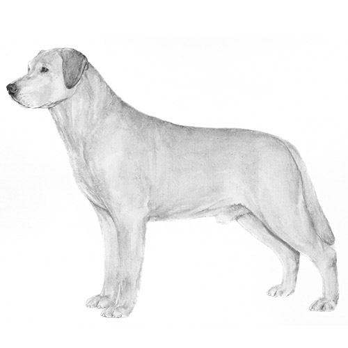
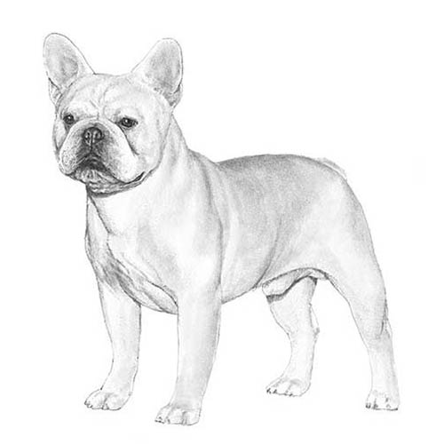
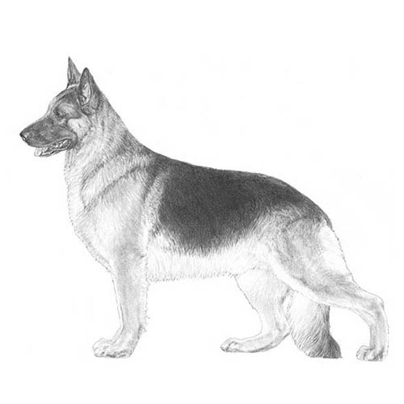
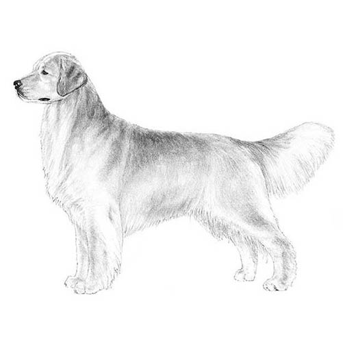
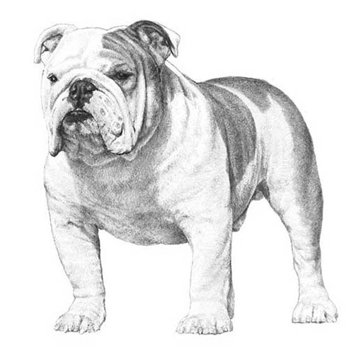
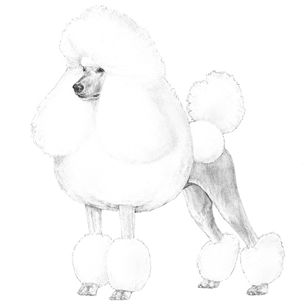
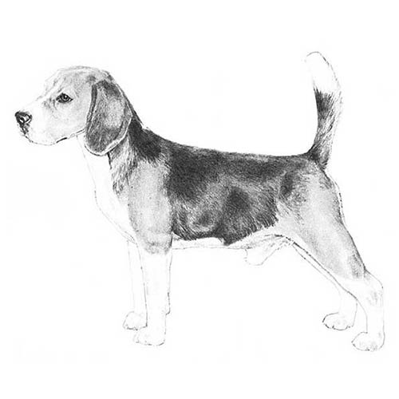
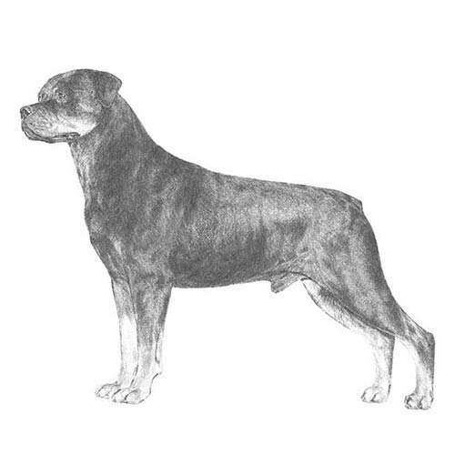
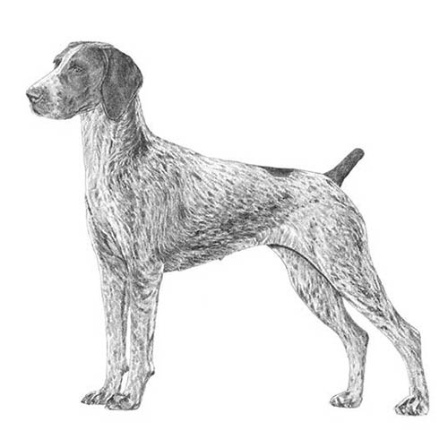
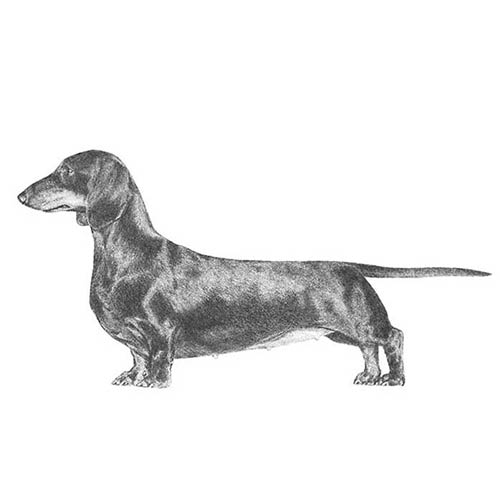

<style>
@import url('https://fonts.googleapis.com/css2?family=Quicksand:wght@500;600;700&display=swap');

body, h1, h2, h3, h4, h5, h6, .callout, p, li, div, span {
  font-family: 'Quicksand', -apple-system, BlinkMacSystemFont, "Segoe UI", Roboto, sans-serif !important;
}

.breed-item {
  display: flex;
  align-items: center;
  gap: 10px;
  background: #fffaf0;
  padding: 6px 10px;
  border-radius: 12px;
  border: 1px solid #fed7aa;
  margin-bottom: 7px;
  transition: transform 0.15s ease-in-out;
}

.breed-item:hover {
  transform: scale(1.02);
  background: #fef3c7;
}

.breed-img {
  width: 42px;
  height: 42px;
  border-radius: 50%;
  object-fit: cover;
  border: 2px solid #f59e0b;
}

h1.title, h2, h3, h4 {
  display: inline-block;
  border-radius: 12px;
  padding: 6px 16px;
  margin-top: 14px;
  margin-bottom: 12px;
}

h1.title {
  background: #fef3c7;
  border: 2.5px solid #d97706;
  color: #92400e;
  box-shadow: 0 3px 6px rgba(217, 119, 6, 0.15);
}

h2 {
  background: #eff6ff;
  border: 2.5px solid #3b82f6;
  color: #1e40af;
  box-shadow: 0 3px 6px rgba(59, 130, 246, 0.15);
}

h3 {
  background: #fff7ed;
  border: 2px solid #f97316;
  color: #9a3412;
  box-shadow: 0 2px 5px rgba(249, 115, 22, 0.12);
}

h4 {
  background: #f0fdf4;
  border: 2px solid #22c55e;
  color: #15803d;
  padding: 4px 12px;
}
</style>

```{r}
#| label: setup
#| message: false

library(tidyverse)
library(plotly)
library(htmlwidgets)
library(leaflet)
```

::: {.callout-note icon=false}
## Chart Key & Navigation Guide

- ⭐ **Gold Star:** Represents one of the **Top 10 Most Popular Dog Breeds** (AKC 2020 ranking).
- 🔵 **Colored Circle:** Represents all other recognized dog breeds.
- **Panels:** Breeds are separated into subplots by **Coat Type**.
- **Axes:** Both **Energy Level** (horizontal) and **Trainability Level** (vertical) are scored from **1 (lowest)** to **5 (highest)**.
- **Interactivity:** Hover over any point to preview stats. **Click any point** to view its full explanation in the summary box below.
:::

::: {.columns}
::: {.column width="70%"}
```{r}
#| label: plot
#| warning: false

# Read traits data and clean non-breaking space characters
breed_traits <- read_csv("breed_traits.csv", show_col_types = FALSE) |>
  mutate(Breed = str_squish(str_replace_all(Breed, "\u00a0", " "))) |>
  filter(`Coat Type` != "Plott Hounds")

# Read rankings to identify the top 10 most popular breeds
breed_rank <- read_csv("breed_rank.csv", show_col_types = FALSE) |>
  mutate(Breed = str_squish(str_replace_all(Breed, "\u00a0", " "))) |>
  select(Breed, Rank = `2020 Rank`)

# Join traits with ranks, label top 10 breeds, and generate explanations
dogs <- breed_traits |>
  left_join(breed_rank, by = "Breed") |>
  mutate(
    Popularity = if_else(!is.na(Rank) & Rank <= 10, "Top 10", "Other"),
    reason = case_when(
      `Energy Level` >= 4 & `Trainability Level` >= 4 ~
        "High Energy & High Trainability (Top-Right): Bred for demanding working, sporting, or herding roles requiring high stamina and close teamwork with handlers.",
      `Energy Level` >= 4 & `Trainability Level` <= 3 ~
        "High Energy & Moderate Trainability (Bottom-Right): Bred for independent tracking, hunting, or terrier tasks where high endurance and tenacity were favored over constant human direction.",
      `Energy Level` <= 3 & `Trainability Level` >= 4 ~
        "Moderate Energy & High Trainability (Top-Left): Highly responsive and eager to please, thriving as family companions or service dogs without needing strenuous daily exercise.",
      TRUE ~
        "Moderate/Lower Energy & Trainability (Bottom-Left): Bred primarily for companionship and quiet household life, with low-to-moderate exercise needs and less formal task training."
    ),
    summary_html = paste0(
      "<h4>", if_else(Popularity == "Top 10", "⭐ ", ""), Breed,
      if_else(!is.na(Rank), paste0(" (AKC Rank #", Rank, ")"), ""), "</h4>",
      "<p><strong>Position:</strong> Energy Level ", `Energy Level`, "/5, Trainability Level ", `Trainability Level`, "/5</p>",
      "<p><strong>Coat:</strong> ", `Coat Type`, " (", `Coat Length`, ") | <strong>Shedding:</strong> ", `Shedding Level`, "/5 | <strong>Grooming:</strong> ", `Coat Grooming Frequency`, "/5</p>",
      "<p><strong>Why it sits here:</strong> ", reason, "</p>"
    )
  )

# Plot breeds with colorful circles for regular breeds and gold stars for top 10
p <- dogs |>
  ggplot(aes(x = `Energy Level`, y = `Trainability Level`, customdata = summary_html)) +
  # Other breeds colored by coat type
  geom_jitter(
    data = filter(dogs, Popularity == "Other"),
    aes(
      color = `Coat Type`,
      text = paste0("Breed: ", Breed,
                    "<br>Energy: ", `Energy Level`,
                    "<br>Trainability: ", `Trainability Level`,
                    "<br>Coat: ", `Coat Type`)
    ),
    width = 0.2, height = 0.2, size = 2, alpha = 0.7
  ) +
  # Top 10 breeds highlighted in gold
  geom_jitter(
    data = filter(dogs, Popularity == "Top 10"),
    aes(
      text = paste0("⭐ Rank #", Rank, ": ", Breed,
                    "<br>Energy: ", `Energy Level`,
                    "<br>Trainability: ", `Trainability Level`,
                    "<br>Coat: ", `Coat Type`)
    ),
    shape = 8, size = 4, stroke = 1.6, color = "#D97706",
    width = 0.2, height = 0.2
  ) +
  facet_wrap(~ `Coat Type`) +
  labs(
    title = "Dog Breeds: Energy vs. Trainability by Coat Type",
    x = "Energy Level (1-5)",
    y = "Trainability Level (1-5)"
  ) +
  theme_minimal() +
  theme(legend.position = "none")

# Convert to plotly and style top 10 markers as golden stars
plt <- ggplotly(p, tooltip = "text")

for (i in seq_along(plt$x$data)) {
  if (identical(plt$x$data[[i]]$marker$symbol, "asterisk-open")) {
    plt$x$data[[i]]$marker$symbol <- "star"
    plt$x$data[[i]]$marker$size <- 14
    plt$x$data[[i]]$marker$color <- "#D97706"
  }
}

# Attach click event to update the breed summary box
plt |>
  onRender("
    function(el) {
      el.on('plotly_click', function(data) {
        var pt = data.points[0];
        if (pt && pt.customdata) {
          document.getElementById('breed-summary-box').innerHTML = pt.customdata;
        }
      });
    }
  ")
```
:::

::: {.column width="30%"}
<div style="text-align: center; margin-bottom: 12px;">
  
  <br>
  <h3 style="margin-top: 8px; margin-bottom: 8px;">⭐ Top 10 Breeds ⭐</h3>
</div>

<div class="breed-item">
  
  <div><strong>1. Labrador</strong><br><small style="color: #78716c;">Double Coat</small></div>
</div>

<div class="breed-item">
  
  <div><strong>2. French Bulldog</strong><br><small style="color: #78716c;">Smooth Coat</small></div>
</div>

<div class="breed-item">
  
  <div><strong>3. German Shepherd</strong><br><small style="color: #78716c;">Double Coat</small></div>
</div>

<div class="breed-item">
  
  <div><strong>4. Golden Retriever</strong><br><small style="color: #78716c;">Double Coat</small></div>
</div>

<div class="breed-item">
  
  <div><strong>5. Bulldog</strong><br><small style="color: #78716c;">Smooth Coat</small></div>
</div>

<div class="breed-item">
  
  <div><strong>6. Poodle</strong><br><small style="color: #78716c;">Curly Coat</small></div>
</div>

<div class="breed-item">
  
  <div><strong>7. Beagle</strong><br><small style="color: #78716c;">Smooth Coat</small></div>
</div>

<div class="breed-item">
  
  <div><strong>8. Rottweiler</strong><br><small style="color: #78716c;">Smooth Coat</small></div>
</div>

<div class="breed-item">
  
  <div><strong>9. G.S. Pointer</strong><br><small style="color: #78716c;">Smooth Coat</small></div>
</div>

<div class="breed-item">
  
  <div><strong>10. Dachshund</strong><br><small style="color: #78716c;">Smooth Coat</small></div>
</div>
:::
:::

## Selected Breed Summary

<div id="breed-summary-box" style="padding: 16px; background-color: #f8f9fa; border-left: 5px solid #0d6efd; border-radius: 4px; margin-top: 15px; margin-bottom: 25px; min-height: 100px;">
  <p><em>Click on any dog breed (or star) in the graph above to see an explanation of its traits, ranking, and why it sits at its position.</em></p>
</div>

## 🌍 Global Breed Origins Map

```{r}
#| label: map
#| warning: false

# Read origins data for geographic locations
breed_origins <- read_csv("breed_origins.csv", show_col_types = FALSE)

# Combine origins with breed traits and popularity rank
map_data <- breed_origins |>
  left_join(select(dogs, Breed, Popularity, Rank, `Coat Type`, `Energy Level`, `Trainability Level`), by = "Breed") |>
  mutate(
    popup_text = paste0(
      "<div style=\"font-family: sans-serif;\">",
      "<strong>", if_else(Popularity == "Top 10", "⭐ ", ""), Breed, "</strong><br>",
      "📍 <strong>Country:</strong> ", Country, "<br>",
      if_else(Popularity == "Top 10", paste0("🏆 <strong>AKC Rank:</strong> #", Rank, "<br>"), ""),
      "🐕 <strong>Coat Type:</strong> ", `Coat Type`, "<br>",
      "⚡ <strong>Energy:</strong> ", `Energy Level`, "/5 | 🎓 <strong>Trainability:</strong> ", `Trainability Level`, "/5",
      "</div>"
    )
  )

# Build interactive leaflet map
leaflet(map_data, width = "100%", height = "480px") |>
  addProviderTiles(providers$CartoDB.Positron) |>
  addCircleMarkers(
    lng = ~JitterLng,
    lat = ~JitterLat,
    popup = ~popup_text,
    label = ~paste0(Breed, " (", Country, ")"),
    radius = ~if_else(Popularity == "Top 10", 7, 5),
    color = ~if_else(Popularity == "Top 10", "#d97706", "#2563eb"),
    fillColor = ~if_else(Popularity == "Top 10", "#f59e0b", "#60a5fa"),
    fillOpacity = 0.8,
    weight = 1.5
  ) |>
  addLegend(
    position = "bottomright",
    colors = c("#f59e0b", "#60a5fa"),
    labels = c("⭐ Top 10 Breed", "Other Recognized Breed"),
    title = "Breed Status",
    opacity = 0.9
  )
```
